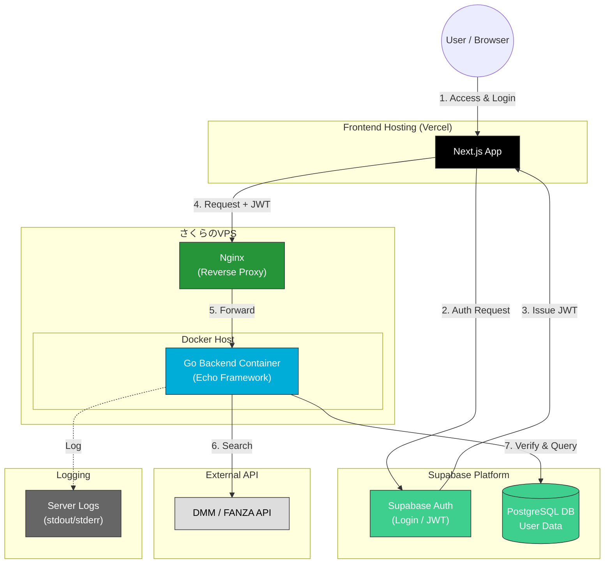
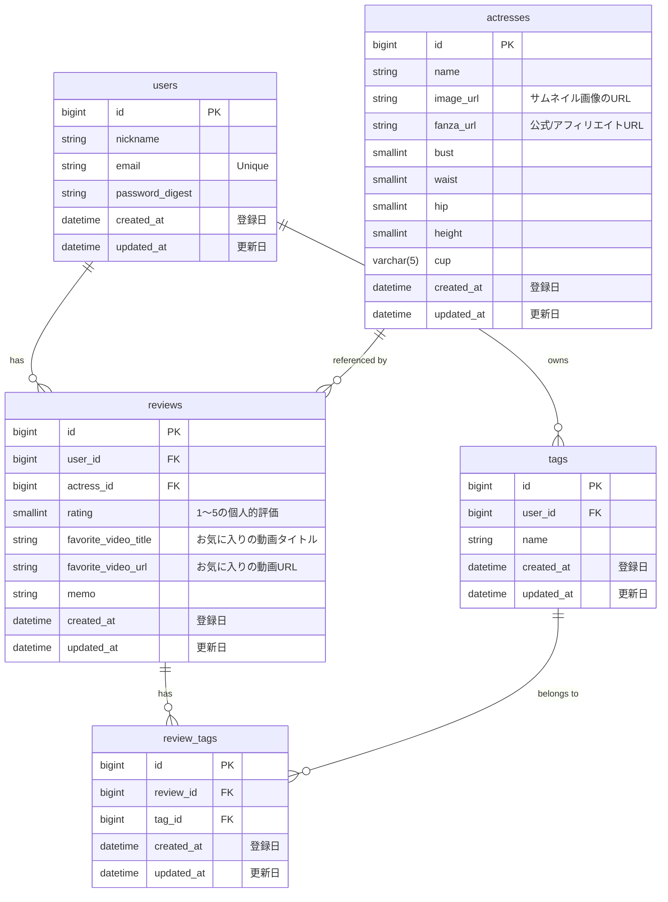

# Muse Log 💋

**Muse Log** は、お気に入りの女優や作品を収集・管理し、美しいカード形式で共有できる「裏研究」プラットフォームです。
Dockerコンテナとしてデプロイされ、BaaS（Supabase）と連携することで、**「クロスデバイス同期」「高速なレスポンス」「堅牢なセキュリティ」**を実現しています。

## 🚀 特徴

- **Account Sync**: Supabase Authによるセキュアなアカウント管理。PCで保存したリストをスマホで即座に確認できます。
- **Smart Sharing**: お気に入りリストをOGP（画像付きカード）としてSNSで美しく共有。
- **High Performance**: Go言語による高速なバックエンド。
- **Privacy First**: 収集するのはメールアドレスのみ。検索履歴や閲覧データは厳重に保護されます。

-----

## 🗺 システム構成図

## 🧩 構成要素と役割

### 1\. Frontend & Entry Point

| サービス | 技術スタック | 役割・選定理由 |
| :--- | :--- | :--- |
| **Vercel** | **Next.js** | **フロントエンドのホスティング**。 GitHubへのプッシュを検知して自動デプロイを行う。Next.jsとの親和性が非常に高い。 |
| **Nginx** | - | **リバースプロキシ**。 さくらのVPS上で動作し、バックエンドコンテナへのリクエストを振り分ける。SSL終端やアクセス制御も担当。 |

### 2\. Backend (Compute)

| サービス | 技術スタック | 役割・選定理由 |
| :--- | :--- | :--- |
| **Docker** | **Go (Echo)** | **ビジネスロジックの中枢**。 さくらのVPS上でGo製のWebアプリケーションをコンテナ化して実行。デプロイの再現性とポータビリティを確保する。 |

### 3\. Database & Auth (SaaS)

| サービス | 技術スタック | 役割・選定理由 |
| :--- | :--- | :--- |
| **Supabase Auth** | - | **認証基盤**。 ユーザー管理（メール/パスワード、SNSログイン）を提供し、アクセストークン（JWT）を発行する。 |
| **Supabase DB** | **PostgreSQL** | **リレーショナルデータベース**。 ユーザーのプロフィール、お気に入りリスト、タグ情報などを保存。 Goバックエンドからの接続には内蔵の\*\*Connection Pooler (Supavisor)\*\*を使用する。 |

### 4\. External

| サービス | 役割 |
| :--- | :--- |
| **DMM API** | 女優情報、作品情報、パッケージ画像の取得元。 |

## 📊 データ構造（DBスキーマ）

アプリケーションの核となるデータモデルは、公開情報（actresses）と個人情報（reviews, tags）を明確に分離した正規化構造を採用しています。

## 🚀 デプロイ戦略

フロントエンドとバックエンドは完全に分離してデプロイします。

| 対象 | トリガー | CI/CD パイプライン |
| :--- | :--- | :--- |
| **Frontend** | `main`ブランチへのPush | **Vercel**が自動で検知し、ビルドとデプロイを実行する。 |
| **Backend** | `main`ブランチへのPush | **GitHub Actions**が以下の処理を自動で実行する。 1. Goのテストを実行 2. Dockerイメージをビルド 3. イメージを **GHCR** (GitHub Container Registry) へプッシュ 4. 本番サーバーへSSH接続し、`docker compose`コマンドで最新のイメージをプルしてコンテナを再起動 |

## 🐳 Dockerの使用方針

開発環境から本番環境まで、一貫してDockerを利用します。

  - **本番 (Production):** さくらのVPS上で`docker-compose.yml` に基づいて、Goバックエンドコンテナをサーバー上で実行します。
  - **開発 (Local):** `docker-compose` を使用して、本番に近い環境でアプリケーションを起動し、ホットリロードを活用して開発効率を高めます。

-----

⚠️ 免責事項 (Disclaimer)
本アプリは個人の技術研究を目的とした非公式アプリです。 データの取得には [DMM.com](https://affiliate.dmm.com/api/) WebサービスAPI を利用しています。

本アプリ内で表示されるコンテンツの著作権は各権利者に帰属します。

本アプリの利用により生じた損害について、開発者は一切の責任を負いません。

*Created by Muse Log Architecture Team*
