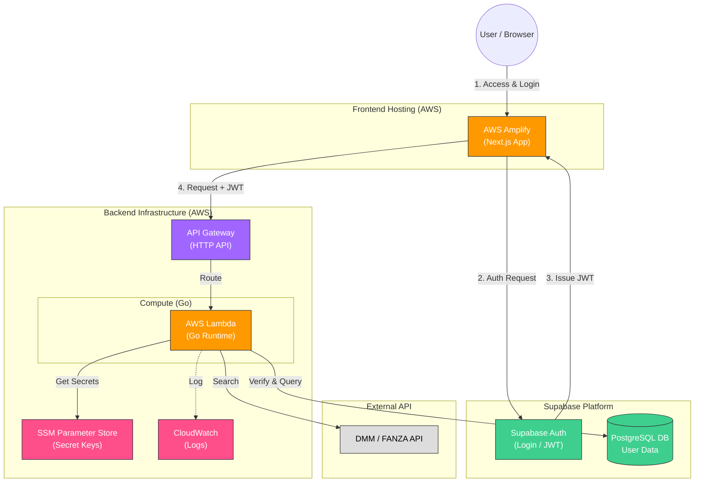
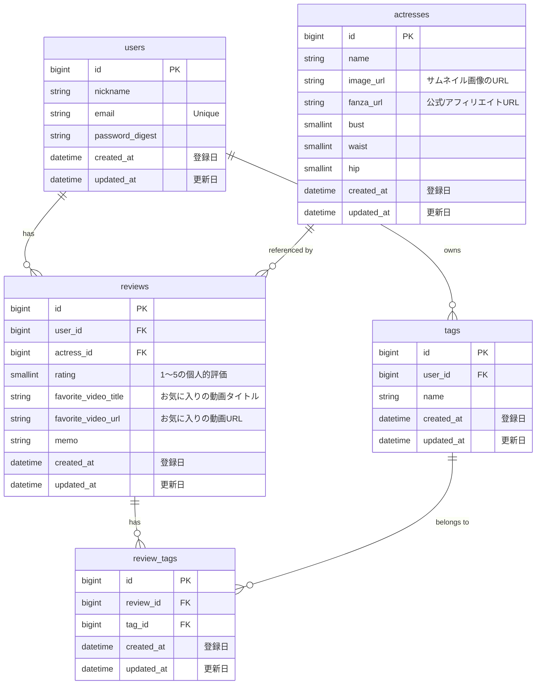

# Muse Log 💋

**Muse Log** は、お気に入りの女優や作品を収集・管理し、美しいカード形式で共有できる「裏研究」プラットフォームです。
サーバーレス技術（AWS Lambda + Go）と最新のBaaS（Supabase）を組み合わせ、**「クロスデバイス同期」「高速なレスポンス」「堅牢なセキュリティ」**を実現しています。

## 🚀 特徴

- **Account Sync**: Supabase Authによるセキュアなアカウント管理。PCで保存したリストをスマホで即座に確認できます。
- **Smart Sharing**: お気に入りリストをOGP（画像付きカード）としてSNSで美しく共有。
- **High Performance**: Go言語による爆速Lambdaバックエンド。
- **Privacy First**: 収集するのはメールアドレスのみ。検索履歴や閲覧データは厳重に保護されます。

-----

## 🗺 システム構成図

## 🧩 構成要素と役割

### 1\. Frontend & Entry Point

| サービス | 技術スタック | 役割・選定理由 |
| :--- | :--- | :--- |
| **AWS Amplify** | **Next.js** | **フロントエンドのホスティング**。 GitHubへのプッシュを検知して自動デプロイを行う。裏側でCloudFrontが動作し、コンテンツを高速配信する。 |
| **API Gateway** | **HTTP API** | **バックエンドへの入り口**。 フロントエンドからのリクエストを受け付け、Lambdaへルーティングする。CORS制御や流量制限も担う。 |

### 2\. Backend (Compute)

| サービス | 技術スタック | 役割・選定理由 |
| :--- | :--- | :--- |
| **AWS Lambda** | **Go (1.x / al2023)** | **ビジネスロジックの中枢**。 Dockerコンテナではなく、\*\*Goバイナリ（Zip）\*\*としてデプロイすることで、コールドスタートを最小限に抑える。 DMM APIの呼び出しやDB操作を行う。 |
| **SSM Parameter Store** | - | **機密情報の金庫**。 DMM APIキー、Supabase接続文字列、JWTシークレットなどを暗号化して管理する。 |
| **CloudWatch** | - | **監視ログ**。 Lambdaの実行ログ（標準出力・エラー）を自動的に収集・保存する。 |

### 3\. Database & Auth (SaaS)

| サービス | 技術スタック | 役割・選定理由 |
| :--- | :--- | :--- |
| **Supabase Auth** | - | **認証基盤**。 ユーザー管理（メール/パスワード、SNSログイン）を提供し、アクセストークン（JWT）を発行する。 |
| **Supabase DB** | **PostgreSQL** | **リレーショナルデータベース**。 ユーザーのプロフィール、お気に入りリスト、タグ情報などを保存。 Lambdaからの接続には内蔵の\*\*Connection Pooler (Supavisor)\*\*を使用する。 |

### 4\. External

| サービス | 役割 |
| :--- | :--- |
| **DMM API** | 女優情報、作品情報、パッケージ画像の取得元。 |

## 📊 データ構造（DBスキーマ）

アプリケーションの核となるデータモデルは、公開情報（actresses）と個人情報（reviews, tags）を明確に分離した正規化構造を採用しています。

## 🚀 デプロイ戦略

フロントエンドとバックエンドは完全に分離してデプロイします。

| 対象 | デプロイ先 | 手法 |
| :--- | :--- | :--- |
| **Frontend** (Next.js) | **AWS Amplify** | **Git Push** (GitHub連携による自動CI/CD) |
| **Backend** (Go) | **AWS Lambda** | **AWS CDK** (`cdk deploy` コマンドでZipアップロード) |

## 🐳 Dockerの使用方針

本番環境（AWS）ではDockerを使用しませんが、開発効率化のためにローカルでのみ使用します。

  - **本番 (Production):** Docker不使用。Goバイナリを直接Lambdaで実行。
  - **開発 (Local):** `docker-compose` を使用して、Supabase (DB) のモックやホットリロード環境を構築。

-----

⚠️ 免責事項 (Disclaimer)
本アプリは個人の技術研究を目的とした非公式アプリです。 データの取得には [DMM.com](https://affiliate.dmm.com/api/) WebサービスAPI を利用しています。

本アプリ内で表示されるコンテンツの著作権は各権利者に帰属します。

本アプリの利用により生じた損害について、開発者は一切の責任を負いません。

*Created by Muse Log Architecture Team*
