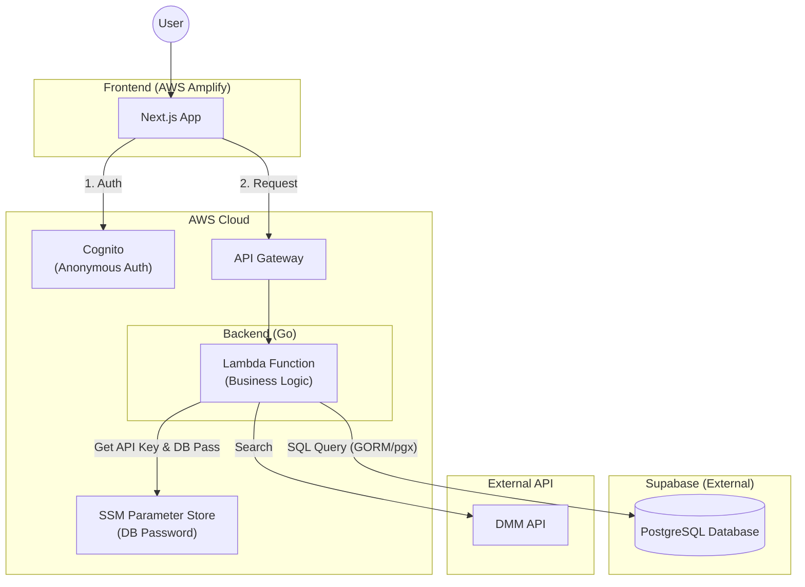

# Muse Log 💋

**Muse Log** は、お気に入りの女優を匿名かつセキュアに収集・共有するための「裏研究」プラットフォームです。
サーバーレス技術と最新のフロントエンド技術を駆使し、**「高パフォーマンス」「低コスト」「完全なプライバシー」**を実現しています。

## 🚀 コンセプト

- **Anonymous by Default**: ユーザー登録不要。Cognitoによる匿名認証で、端末ごとのプライバシーを保護します。
- **Secure Sharing**: お気に入りリストをOGP（画像付きカード）としてSNSで美しく共有。
- **High Performance**: Go言語による爆速Lambdaバックエンドと、Supabaseによるリレーショナルデータ管理。

## 🏗 アーキテクチャ

AWS Lambda (Go) と Supabase (PostgreSQL) を組み合わせたハイブリッド構成です。

## 🛠 技術スタック

| カテゴリ | 技術選定 | 役割 |
| :--- | :--- | :--- |
| **Frontend** | **Next.js 14+** (App Router) | UI / SSR / OGP生成 |
| **Styling** | **Tailwind CSS** + **shadcn/ui** | デザインシステム |
| **Backend** | **Go** (AWS Lambda) | ビジネスロジック / API処理 |
| **Infrastructure** | **AWS CDK** (Go) | IaC (インフラのコード化) |
| **Database** | **Supabase** (PostgreSQL) | ユーザーデータ / レビュー保存 |
| **Auth** | **Amazon Cognito** | 匿名認証 (Unauthenticated Identity) |
| **API** | **DMM API** | 女優・作品データの検索 |