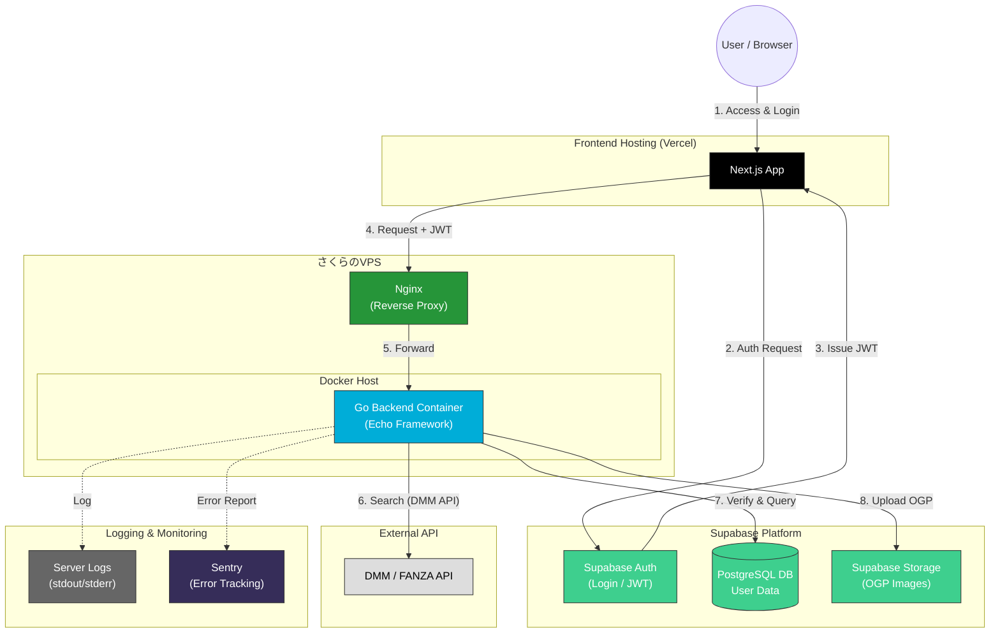
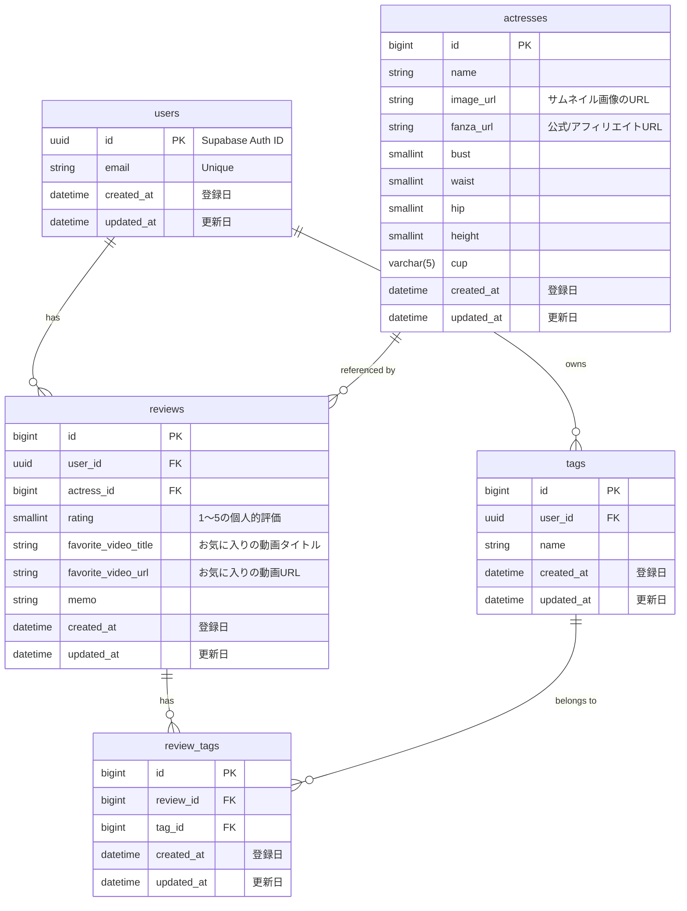

# Muse Log 💋

**Muse Log** は、お気に入りの女優や作品を収集・管理し、美しいカード形式で共有できる「裏研究」プラットフォームです。
Dockerコンテナとしてデプロイされ、BaaS（Supabase）と連携することで、**「クロスデバイス同期」「高速なレスポンス」「堅牢なセキュリティ」** を実現しています。


## 📚 ドキュメント構成

- **README.md** (本ファイル): プロジェクト概要・システムアーキテクチャ
- **[REQUIREMENTS.md](./REQUIREMENTS.md)**: 機能要件・画面仕様
- **[TECHNICAL_SPEC.md](./TECHNICAL_SPEC.md)**: 技術仕様・非機能要件・データ設計
- **[DEVELOPMENT.md](./DEVELOPMENT.md)**: 開発環境・運用ガイド
- **[DEPLOYMENT.md](./DEPLOYMENT.md)**: デプロイ手順
- **[SCREEN_FLOW.md](./SCREEN_FLOW.md)**: 画面遷移図

## 💡 目的・背景

このアプリは、以下のような個人的な課題を解決するために作られました。

- お気に入りの人のステータス情報を管理するのが面倒
- 普段「こんな感じの人を見たい」という時に探すのが面倒
- お気に入りの人を忘れてしまう
- メモで管理していたら、どんな顔だったか等を忘れてしまう

---

## 🚀 特徴

- **Account Sync**: Supabase Authによるセキュアなアカウント管理。PCで保存したリストをスマホで即座に確認できます。
- **Smart Sharing**: お気に入りリストをOGP（画像付きカード）としてSNSで美しく共有。
- **High Performance**: Go言語による高速なバックエンド。
- **Privacy First**: 収集するのはメールアドレスのみ。検索履歴や閲覧データは厳重に保護されます。

---

## 🔧 技術選定理由

### フロントエンド

#### Next.js (App Router)

ファイルベースルーティングによる開発体験の良さと、Vercel との親和性の高さ。App Router の Client Component として全ページを実装することで、SPAに近い操作感を実現しつつ、将来的なSSR/SSG対応の余地も残せる。

#### SWR

サーバーとの非同期データ取得・キャッシュ管理・再フェッチをシンプルに記述できる。本プロジェクトは小規模でページネーションを多用しない設計のため、SWRの機能で十分対応できる。Next.js と同じ Vercel 製であり親和性も高い。

#### shadcn/ui + Tailwind CSS

shadcn/ui はコンポーネントのソースをプロジェクト内に直接コピーする設計のため、デザインの自由度が高い。Radix UI ベースのアクセシビリティ（WAI-ARIA）が標準で備わり、Dialog・DropdownMenu 等の複雑なインタラクションをゼロから実装せずに済む。Tailwind CSS との組み合わせでスタイルの一貫性を保ちやすい。

#### React Hook Form + Zod

`useFieldArray` を活用することで動画リストのような動的フィールドをシンプルに管理できる。Zod のスキーマ定義とフォームバリデーションが型レベルで一致するため、バリデーションロジックの二重管理が不要になる。

---

### バックエンド

#### Go + Echo

Go はコンパイル済みバイナリのため起動が速く、メモリ消費量が Node.js や Python より大幅に小さい。さくらのVPS（低スペック環境）での運用を想定しているため、リソース効率が最重要要件だった。Echo はミドルウェアの組み合わせが直感的。

---

### インフラ・SaaS

#### Supabase（Auth + PostgreSQL + Storage）

Auth・DB・Storage を一括で提供する BaaS のため、初期構築コストが極めて低い。Row Level Security (RLS) によってDBレベルでのアクセス制御が可能で、JWT との統合も標準機能として備わっている。OAuth（Google / Apple）も設定ベースで追加できる。

#### Vercel（フロントエンドホスティング）

Next.js の開発元が提供するホスティングサービスのため、App Router の機能を最大限に活用できる。GitHub へのプッシュで自動デプロイ・プレビュー環境が生成され、CI/CD の設定がほぼ不要。無料枠で十分まかなえる規模感。

#### さくらのVPS + Docker（バックエンドホスティング）

さくらのVPSを採用した直接の理由は、**高専キャリアが提供する「ミライサーバー」** を活用することで、さくらのVPS上のUbuntuサーバーを無料で利用できるためである。Docker でコンテナ化することで、開発環境と本番環境の差異をなくし、将来的な移行先（AWS, GCP 等）への可搬性も確保している。

---

## 🗺 システム構成図



## 🧩 構成要素と役割

### 1. Frontend & Entry Point

| サービス   | 技術スタック                  | 役割・選定理由                                                                                                                                                |
| :--------- | :---------------------------- | :------------------------------------------------------------------------------------------------------------------------------------------------------------ |
| **Vercel** | **Next.js 16.2 (App Router)** | **フロントエンドのホスティング**。<br>GitHubへのプッシュを検知して自動デプロイを行う。Next.jsとの親和性が非常に高い。<br>Edge Functions, ISR, SSRをサポート。 |
| **Nginx**  | -                             | **リバースプロキシ**。<br>さくらのVPS上で動作し、バックエンドコンテナへのリクエストを振り分ける。SSL終端やアクセス制御も担当。                                |

### 2. Backend (Compute)

| サービス   | 技術スタック            | 役割・選定理由                                                                                                                                                                              |
| :--------- | :---------------------- | :------------------------------------------------------------------------------------------------------------------------------------------------------------------------------------------ |
| **Docker** | **Go 1.26.x (Echo v4)** | **ビジネスロジックの中枢**。<br>さくらのVPS上でGo製のWebアプリケーションをコンテナ化して実行。デプロイの再現性とポータビリティを確保する。<br>高速なAPIレスポンスと低メモリフットプリント。 |

### 3. Database & Auth (SaaS)

| サービス             | 技術スタック         | 役割・選定理由                                                                                                                                                                                                                      |
| :------------------- | :------------------- | :---------------------------------------------------------------------------------------------------------------------------------------------------------------------------------------------------------------------------------- |
| **Supabase Auth**    | -                    | **認証基盤**。<br>ユーザー管理（メール/パスワード、OAuth）を提供し、アクセストークン（JWT）を発行する。<br>メール確認、パスワードリセット機能を内蔵。                                                                               |
| **Supabase DB**      | **PostgreSQL 15+**   | **リレーショナルデータベース**。<br>ユーザーのプロフィール、お気に入りリスト、タグ情報などを保存。<br>Goバックエンドからの接続には**Supavisor (Connection Pooler)** を使用。<br>Row Level Security (RLS) による細かいアクセス制御。 |
| **Supabase Storage** | **S3互換ストレージ** | **画像・ファイルストレージ**。<br>OGP画像の保存、女優画像のキャッシュ（オプション）。                                                                                                                                               |

### 4. External Services

| サービス              | 役割                                                                                             |
| :-------------------- | :----------------------------------------------------------------------------------------------- |
| **DMM API**           | 女優情報、作品情報、パッケージ画像の取得元。<br>**レート制限**: 要確認（通常1秒1リクエスト程度） |
| **Sentry** (Optional) | エラートラッキング・パフォーマンス監視                                                           |

---

## 📊 データ構造（DBスキーマ）

アプリケーションの核となるデータモデルは、公開情報（actresses）と個人情報（reviews, tags）を明確に分離した正規化構造を採用しています。



**詳細なスキーマ定義・制約・インデックスは [TECHNICAL_SPEC.md](./TECHNICAL_SPEC.md) を参照**

---

## 🚀 デプロイ戦略

フロントエンドとバックエンドは完全に分離してデプロイします。

| 対象         | トリガー               | CI/CD パイプライン                                                                                                                                                                                                                                                                                                    |
| :----------- | :--------------------- | :-------------------------------------------------------------------------------------------------------------------------------------------------------------------------------------------------------------------------------------------------------------------------------------------------------------------- |
| **Frontend** | `main`ブランチへのPush | **Vercel**が自動で検知し、ビルドとデプロイを実行する。<br>プレビューデプロイは Pull Request 単位で自動生成。                                                                                                                                                                                                          |
| **Backend**  | `main`ブランチへのPush | **GitHub Actions**が以下の処理を自動で実行する。<br>1. Goのテストを実行（カバレッジ80%以上）<br>2. Dockerイメージをビルド<br>3. イメージを **GHCR** (GitHub Container Registry) へプッシュ<br>4. 本番サーバーへSSH接続し、`docker compose`コマンドで最新のイメージをプルしてコンテナを再起動<br>5. ヘルスチェック実行 |

---

## 🐳 Dockerの使用方針

開発環境から本番環境まで、一貫してDockerを利用します。

- **本番 (Production):** さくらのVPS上で `backend/docker-compose.yml` に基づいて、Goバックエンドコンテナをサーバー上で実行します。
- **開発 (Local):** 同じく `backend/docker-compose.yml` を使用して、本番に近い環境でアプリケーションを起動し、ホットリロードを活用して開発効率を高めます。

```bash
# 開発環境起動
cd backend
docker-compose up

# 本番環境起動（さくらのVPS上など）
cd backend
docker-compose up -d
```

---

## 🔐 セキュリティ方針

### 認証・認可

- **JWT**: Supabase Authが発行。有効期限1時間、リフレッシュトークンで自動更新。
- **RLS (Row Level Security)**: Supabase DB で各ユーザーのデータを完全分離。
- **CORS**: フロントエンドドメインのみ許可。

### データ保護

- **HTTPS**: 全通信を暗号化（Let's Encrypt）
- **環境変数**: GitHub Secrets, `.env.local` で管理。本番環境では環境変数注入。
- **パスワード**: Supabase Authが bcrypt でハッシュ化。

**詳細なセキュリティ仕様は [TECHNICAL_SPEC.md](./TECHNICAL_SPEC.md) を参照**

---

## 🧪 テスト戦略

| テスト種別            | ツール                            | カバレッジ目標   |
| :-------------------- | :-------------------------------- | :--------------- |
| **Backend Unit Test** | Go testing                        | 80%以上          |
| **Integration Test**  | Supertest (API), Playwright (E2E) | 主要フロー100%   |
| **Manual Test**       | -                                 | リリース前に実施 |

---

## 📞 サポート・問い合わせ

- **Issue Tracker**: [GitHub Issues](https://github.com/akito-0520/MuseLog/issues)
- **開発者**: akito-0520, Rtosshy, f-yusei

---

⚠️ **免責事項 (Disclaimer)**

本アプリは個人の技術研究を目的とした非公式アプリです。データの取得には [DMM.com](https://affiliate.dmm.com/api/) WebサービスAPI を利用しています。

<a href="https://affiliate.dmm.com/api/">
  
</a>

本アプリ内で表示されるコンテンツの著作権は各権利者に帰属します。本アプリの利用により生じた損害について、開発者は一切の責任を負いません。

---

_Created by Muse Log Architecture Team_
