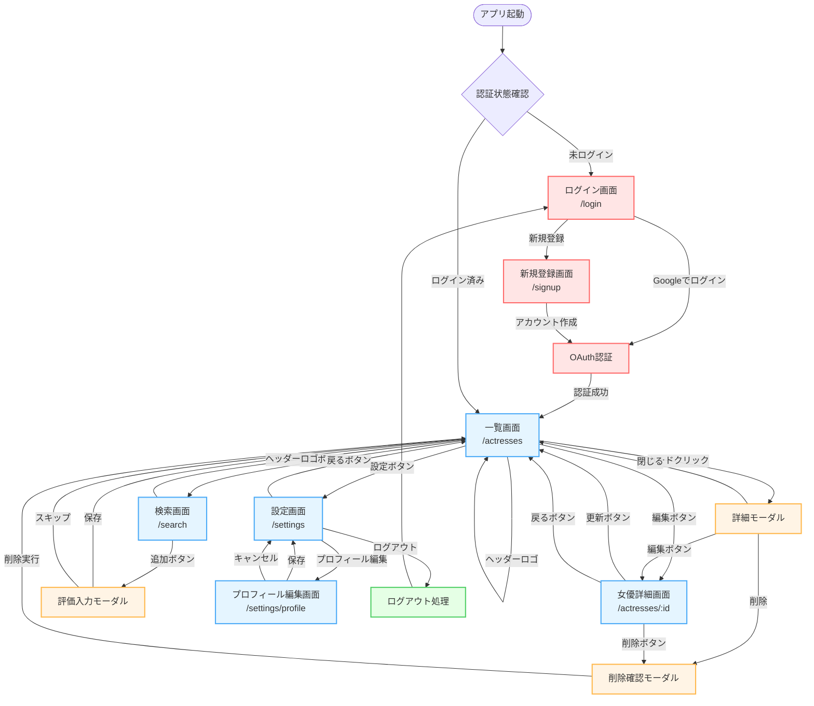
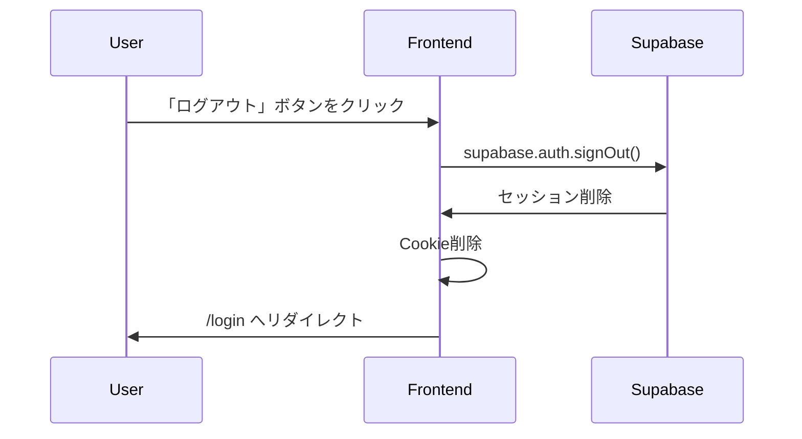

# 画面遷移・ルーティング定義

本ドキュメントは Muse Log の画面遷移フロー、URL設計、ナビゲーション構造を定義します。

## 📑 目次

1. [全体画面遷移図](#1-全体画面遷移図)
2. [ルーティングテーブル](#2-ルーティングテーブル)
3. [認証フロー](#3-認証フロー)
4. [画面別遷移パターン](#4-画面別遷移パターン)
5. [モーダル・ダイアログ](#5-モーダルダイアログ)
6. [エラーページ](#6-エラーページ)
7. [URL設計ガイドライン](#7-url設計ガイドライン)

---

## 1. 全体画面遷移図

### 1.1 メインフロー



---

### 1.2 認証フロー（詳細）

```mermaid
graph TD
    Start([ユーザー訪問]) --> CheckURL{アクセスURL確認}

    %% 公開ページ
    CheckURL -->|/login, /signup| Public[公開ページ表示]
    Public --> End1([表示完了])

    %% 保護されたページ
    CheckURL -->|/actresses, /search, /settings| Protected{認証チェック}

    Protected -->|JWT有効| AllowAccess[ページ表示]
    AllowAccess --> End2([表示完了])

    Protected -->|JWT無効/なし| RedirectLogin[/loginへリダイレクト]
    RedirectLogin --> StoreRedirect[元のURLを保存]
    StoreRedirect --> ShowLogin[ログイン画面表示]

    ShowLogin --> UserLogin[ユーザーがログイン]
    UserLogin --> GetJWT[JWT取得]
    GetJWT --> RedirectOriginal[元のURLへリダイレクト]
    RedirectOriginal --> AllowAccess

    %% スタイル
    classDef decision fill:#FFE5E5,stroke:#FF6B6B,stroke-width:2px
    classDef action fill:#E5F5FF,stroke:#4DABF7,stroke-width:2px
    classDef endpoint fill:#E5FFE5,stroke:#51CF66,stroke-width:2px

    class CheckURL,Protected decision
    class RedirectLogin,StoreRedirect,ShowLogin,UserLogin,GetJWT,RedirectOriginal action
    class Public,AllowAccess,End1,End2 endpoint
```

---

## 2. ルーティングテーブル

### 2.1 Next.js App Router ディレクトリ構造

```
app/
├── (auth)/              # 認証関連のレイアウトグループ
│   ├── login/
│   │   └── page.tsx     # /login
│   └── signup/
│       └── page.tsx     # /signup
│
├── (main)/              # メインアプリのレイアウトグループ
│   ├── layout.tsx       # 共通レイアウト（ヘッダー・フッター）
│   ├── actresses/
│   │   ├── page.tsx     # /actresses（一覧）
│   │   └── [id]/
│   │       └── page.tsx # /actresses/:id（詳細）
│   ├── search/
│   │   └── page.tsx     # /search
│   └── settings/
│       ├── page.tsx     # /settings
│       └── profile/
│           └── page.tsx # /settings/profile
│
├── api/                 # API Routes（バックエンドへのプロキシ）
│   └── [...path]/
│       └── route.ts
│
├── not-found.tsx        # 404ページ
├── error.tsx            # エラーページ
├── layout.tsx           # ルートレイアウト
└── page.tsx             # / (ルートページ → /actresses へリダイレクト)
```

---

### 2.2 ルーティング一覧

| パス                | ページ名           | 認証 | 説明                                                   |
| :------------------ | :----------------- | :--- | :----------------------------------------------------- |
| `/`                 | ルートページ       | -    | `/actresses` へ自動リダイレクト                        |
| `/login`            | ログイン画面       | ❌   | OAuth (Google) ログイン                                |
| `/signup`           | 新規登録画面       | ❌   | OAuth (Google) 新規登録                                |
| `/actresses`        | 一覧画面（ホーム） | ✅   | お気に入り一覧（ページネーション・ソート・フィルター） |
| `/actresses/:id`    | 女優詳細画面       | ✅   | レビュー編集・削除                                     |
| `/search`           | 検索画面           | ✅   | DMM API で女優検索                                     |
| `/settings`         | 設定画面           | ✅   | プロフィール編集、ログアウト                           |
| `/settings/profile` | プロフィール編集   | ✅   | ニックネーム、メール、パスワード変更                   |
| `/404`              | 404ページ          | -    | ページが見つかりません                                 |
| `/error`            | エラーページ       | -    | サーバーエラー                                         |

---

### 2.3 クエリパラメータ

#### `/actresses` (一覧画面)

```
/actresses?sort=created_at&order=desc&tag=巨乳&rating_min=4&q=山田
```

| パラメータ   | 型     | 説明                                        | デフォルト   |
| :----------- | :----- | :------------------------------------------ | :----------- |
| `sort`       | string | ソートキー (`created_at`, `rating`, `name`) | `created_at` |
| `order`      | string | ソート順 (`asc`, `desc`)                    | `desc`       |
| `tag`        | string | タグ名でフィルター                          | -            |
| `rating_min` | number | 最低評価 (1〜5)                             | -            |
| `q`          | string | 女優名で検索                                | -            |

**実装例（Next.js）**:

```typescript
// app/actresses/page.tsx
export default function ActressesPage({
  searchParams,
}: {
  searchParams: {
    page?: string;
    sort?: string;
    order?: string;
    tag?: string;
    rating_min?: string;
    q?: string;
  };
}) {
  const page = Number(searchParams.page) || 1;
  const sort = searchParams.sort || "created_at";
  // ...
}
```

---

#### `/search` (検索画面)

```
/search?q=山田
```

| パラメータ | 型     | 説明           | デフォルト |
| :--------- | :----- | :------------- | :--------- |
| `q`        | string | 検索キーワード | -          |

---

## 3. 認証フロー

### 3.1 ログイン後のリダイレクト

#### パターン1: 直接 `/login` にアクセスした場合

```
/login → ログイン成功 → /actresses
```

#### パターン2: 保護されたページにアクセスしてリダイレクトされた場合

```
/actresses/:id → 未ログイン検知 → /login?redirect=/actresses/:id
→ ログイン成功 → /actresses/:id (元のページに戻る)
```

**実装例（Next.js Middleware）**:

```typescript
// middleware.ts
import { NextResponse } from "next/server";
import type { NextRequest } from "next/server";

export function middleware(request: NextRequest) {
  const token = request.cookies.get("sb-access-token");
  const { pathname } = request.nextUrl;

  // 保護されたルート
  const protectedRoutes = ["/actresses", "/search", "/settings"];
  const isProtected = protectedRoutes.some((route) =>
    pathname.startsWith(route),
  );

  if (isProtected && !token) {
    const url = request.nextUrl.clone();
    url.pathname = "/login";
    url.searchParams.set("redirect", pathname);
    return NextResponse.redirect(url);
  }

  // ログイン済みユーザーが /login にアクセスした場合
  if (token && pathname === "/login") {
    return NextResponse.redirect(new URL("/actresses", request.url));
  }

  return NextResponse.next();
}

export const config = {
  matcher: ["/((?!api|_next/static|_next/image|favicon.ico).*)"],
};
```

---

### 3.2 ログアウト処理



**実装例**:

```typescript
// components/LogoutButton.tsx
async function handleLogout() {
  await supabase.auth.signOut();
  router.push("/login");
}
```

---

## 4. 画面別遷移パターン

### 4.1 ログイン画面 (`/login`)

#### 遷移元

- 未ログイン時に保護されたページへアクセス
- ログアウト後

#### 遷移先

| トリガー                   | 遷移先                   | 条件     |
| :------------------------- | :----------------------- | :------- |
| 「Googleでログイン」ボタン | OAuth認証 → `/actresses` | 認証成功 |
| 「アカウント作成」リンク   | `/signup`                | -        |

---

### 4.2 新規登録画面 (`/signup`)

#### 遷移元

- ログイン画面の「アカウント作成」リンク

#### 遷移先

| トリガー               | 遷移先                   | 条件     |
| :--------------------- | :----------------------- | :------- |
| 「Googleで登録」ボタン | OAuth認証 → `/actresses` | 認証成功 |
| 「ログイン」リンク     | `/login`                 | -        |

---

### 4.3 一覧画面 (`/actresses`)

#### 遷移元

- ログイン成功後
- ヘッダーロゴクリック
- フッター「一覧」タブ
- 詳細画面の「戻る」ボタン
- 検索画面からお気に入り追加後

#### 遷移先

| トリガー                   | 遷移先                              | 条件 |
| :------------------------- | :---------------------------------- | :--- |
| カードクリック             | 詳細モーダル（同一ページ）          | -    |
| 詳細モーダル「編集」ボタン | `/actresses/:id`                    | -    |
| ヘッダー「検索」ボタン     | `/search`                           | -    |
| ヘッダー「設定」アイコン   | `/settings`                         | -    |
| フッター「検索」タブ       | `/search`                           | -    |
| フッター「設定」タブ       | `/settings`                         | -    |
| ページネーション           | `/actresses?page=2`                 | -    |
| ソート変更                 | `/actresses?sort=rating&order=desc` | -    |

---

### 4.4 女優詳細画面 (`/actresses/:id`)

#### 遷移元

- 一覧画面の詳細モーダル「編集」ボタン
- 検索画面からお気に入り追加後（Phase 2）

#### 遷移先

| トリガー       | 遷移先                          | 条件     |
| :------------- | :------------------------------ | :------- |
| 「更新」ボタン | `/actresses`                    | 更新成功 |
| 「削除」ボタン | 削除確認モーダル → `/actresses` | 削除成功 |
| ブラウザバック | `/actresses`                    | -        |
| ヘッダーロゴ   | `/actresses`                    | -        |

**URL例**:

```
/actresses/123
```

---

### 4.5 検索画面 (`/search`)

#### 遷移元

- 一覧画面ヘッダー「検索」ボタン
- フッター「検索」タブ

#### 遷移先

| トリガー             | 遷移先                          | 条件     |
| :------------------- | :------------------------------ | :------- |
| 「追加」ボタン       | 評価入力モーダル → `/actresses` | 保存成功 |
| ヘッダーロゴ         | `/actresses`                    | -        |
| フッター「一覧」タブ | `/actresses`                    | -        |

---

### 4.6 設定画面 (`/settings`)

#### 遷移元

- ヘッダー「設定」アイコン
- フッター「設定」タブ

#### 遷移先

| トリガー             | 遷移先              | 条件           |
| :------------------- | :------------------ | :------------- |
| 「プロフィール編集」 | `/settings/profile` | -              |
| 「ログアウト」ボタン | `/login`            | ログアウト成功 |
| ヘッダーロゴ         | `/actresses`        | -              |

---

### 4.7 プロフィール編集画面 (`/settings/profile`)

#### 遷移元

- 設定画面「プロフィール編集」

#### 遷移先

| トリガー             | 遷移先      | 条件     |
| :------------------- | :---------- | :------- |
| 「保存」ボタン       | `/settings` | 更新成功 |
| 「キャンセル」ボタン | `/settings` | -        |
| ブラウザバック       | `/settings` | -        |

---

## 5. モーダル・ダイアログ

### 5.1 モーダル一覧

| モーダル名                            | 表示元                               | 目的                       | 閉じる方法                          |
| :------------------------------------ | :----------------------------------- | :------------------------- | :---------------------------------- |
| **詳細モーダル**                      | 一覧画面のカードクリック             | 女優情報・評価の表示       | 背景クリック、×ボタン、ESCキー      |
| **評価入力モーダル**                  | 検索画面「追加」ボタン               | お気に入り追加時の評価入力 | 「保存」「スキップ」ボタン、×ボタン |
| **削除確認モーダル**                  | 詳細画面・詳細モーダル「削除」ボタン | お気に入り削除の確認       | 「キャンセル」「削除」ボタン        |
| **ログアウト確認モーダル** (Optional) | 設定画面「ログアウト」ボタン         | ログアウトの確認           | 「キャンセル」「ログアウト」ボタン  |

---

### 5.2 モーダルの実装方針

#### URL変更なし（状態管理）

モーダルは URL を変更せず、React の状態管理で表示/非表示を切り替えます。

**理由**:

- モーダルは一時的なUI要素であり、独立したページではない
- ブラウザバックでモーダルを閉じる体験は混乱を招く
- SEO対象外

**実装例**:

```typescript
// 一覧画面
const [selectedReview, setSelectedReview] = useState<Review | null>(null);

return (
  <>
    <ReviewList onCardClick={(review) => setSelectedReview(review)} />
    {selectedReview && (
      <ReviewDetailModal
        review={selectedReview}
        onClose={() => setSelectedReview(null)}
      />
    )}
  </>
);
```

---

### 5.3 モーダル内の画面遷移

詳細モーダルから「編集」ボタンをクリックした場合:

```
/actresses (モーダル表示中) → /actresses/:id (フルページ遷移)
```

モーダルを閉じてから遷移するのではなく、即座にページ遷移します。

---

## 6. エラーページ

### 6.1 404ページ (`not-found.tsx`)

#### 表示条件

- 存在しないURLにアクセス
- 削除済みのレビューにアクセス（`/actresses/:id` で該当IDが存在しない）

#### 表示内容

- 「ページが見つかりません」メッセージ
- ホームへのリンク（`/actresses`）

**実装例**:

```typescript
// app/not-found.tsx
export default function NotFound() {
  return (
    <div className="flex flex-col items-center justify-center min-h-screen">
      <h1 className="text-4xl font-bold">404</h1>
      <p className="mt-4 text-gray-600">ページが見つかりません</p>
      <Link href="/actresses" className="mt-6 btn-primary">
        ホームに戻る
      </Link>
    </div>
  );
}
```

---

### 6.2 エラーページ (`error.tsx`)

#### 表示条件

- サーバーエラー（500エラー）
- APIエラー
- 予期しないエラー

#### 表示内容

- 「エラーが発生しました」メッセージ
- 「再試行」ボタン
- ホームへのリンク

**実装例**:

```typescript
// app/error.tsx
'use client';

export default function Error({
  error,
  reset,
}: {
  error: Error & { digest?: string };
  reset: () => void;
}) {
  return (
    <div className="flex flex-col items-center justify-center min-h-screen">
      <h1 className="text-4xl font-bold">エラー</h1>
      <p className="mt-4 text-gray-600">{error.message || 'エラーが発生しました'}</p>
      <div className="mt-6 flex gap-4">
        <button onClick={reset} className="btn-primary">
          再試行
        </button>
        <Link href="/actresses" className="btn-secondary">
          ホームに戻る
        </Link>
      </div>
    </div>
  );
}
```

---

## 7. URL設計ガイドライン

### 7.1 基本原則

1. **RESTful**: リソース指向のURL設計
   - ✅ `/actresses/:id`
   - ❌ `/getActress?id=123`

2. **小文字・ケバブケース**: 単語の区切りはハイフン
   - ✅ `/settings/profile`
   - ❌ `/Settings/Profile`, `/settings_profile`

3. **複数形**: コレクションは複数形
   - ✅ `/actresses`
   - ❌ `/actress`

4. **短く明確**: 階層は最小限に
   - ✅ `/actresses/:id`
   - ❌ `/user/favorites/actresses/:id`

5. **クエリパラメータ**: フィルター・ソート・ページネーション
   - ✅ `/actresses?page=2&sort=rating`
   - ❌ `/actresses/page/2/sort/rating`

---

### 7.2 動的パラメータの命名

| パラメータ名 | 説明               | 例                 |
| :----------- | :----------------- | :----------------- |
| `:id`        | リソースID（数値） | `/actresses/123`   |
| `:shareId`   | 共有ID（文字列）   | `/share/abc123xyz` |

---

### 7.3 パンくずリストのための階層設計

```
ホーム (/) > お気に入り一覧 (/actresses) > 女優詳細 (/actresses/:id)
ホーム (/) > 検索 (/search)
ホーム (/) > 設定 (/settings) > プロフィール編集 (/settings/profile)
```

**実装例**:

```typescript
// components/Breadcrumb.tsx
const breadcrumbs = [
  { label: "ホーム", href: "/" },
  { label: "お気に入り一覧", href: "/actresses" },
  { label: "山田花子", href: `/actresses/${id}` },
];
```

---

## 8. ナビゲーションコンポーネント設計

### 8.1 ヘッダーナビゲーション

```typescript
// components/Header.tsx
export function Header() {
  const pathname = usePathname();

  return (
    <header>
      <Link href="/actresses">
        <Logo />
      </Link>

      <nav>
        <Link href="/search" className={pathname === '/search' ? 'active' : ''}>
          検索
        </Link>
        <Link href="/settings" className={pathname.startsWith('/settings') ? 'active' : ''}>
          設定
        </Link>
      </nav>
    </header>
  );
}
```

---

### 8.2 フッターナビゲーション（モバイル）

```typescript
// components/Footer.tsx
export function Footer() {
  const pathname = usePathname();

  const navItems = [
    { label: '一覧', href: '/actresses', icon: Home },
    { label: '検索', href: '/search', icon: Search },
    { label: '設定', href: '/settings', icon: Settings },
  ];

  return (
    <footer className="md:hidden">
      {navItems.map((item) => (
        <Link
          key={item.href}
          href={item.href}
          className={pathname === item.href ? 'active' : ''}
        >
          <item.icon />
          <span>{item.label}</span>
        </Link>
      ))}
    </footer>
  );
}
```

---

## 9. プリフェッチ戦略

### 9.1 Next.js Link コンポーネントのプリフェッチ

Next.js は `<Link>` コンポーネントで自動的にプリフェッチを行います。

```typescript
// プリフェッチ有効（デフォルト）
<Link href="/actresses/123">詳細を見る</Link>

// プリフェッチ無効（動的コンテンツの場合）
<Link href="/search" prefetch={false}>検索</Link>
```

---

### 9.2 プログラマティックナビゲーション

```typescript
import { useRouter } from "next/navigation";

function ReviewCard({ review }: { review: Review }) {
  const router = useRouter();

  const handleEdit = () => {
    router.push(`/actresses/${review.id}`);
  };

  const handleDelete = async () => {
    await deleteReview(review.id);
    router.refresh(); // 現在のページを再検証
  };
}
```

---

## 10. 画面遷移のパフォーマンス最適化

### 10.1 サーバーコンポーネント vs クライアントコンポーネント

| 画面             | 種別             | 理由                               |
| :--------------- | :--------------- | :--------------------------------- |
| `/actresses`     | Server Component | 初回データをSSRで取得、SEO対応     |
| `/actresses/:id` | Server Component | SEO対応、OGP生成                   |
| `/search`        | Client Component | リアルタイム検索、インタラクティブ |
| `/settings`      | Client Component | フォーム処理、状態管理             |

---

### 10.2 ローディング UI

各ルートに `loading.tsx` を配置してSuspense境界を定義:

```
app/
├── actresses/
│   ├── loading.tsx      # 一覧画面のローディング
│   ├── page.tsx
│   └── [id]/
│       ├── loading.tsx  # 詳細画面のローディング
│       └── page.tsx
```

**実装例**:

```typescript
// app/actresses/loading.tsx
export default function Loading() {
  return (
    <div className="grid grid-cols-4 gap-4">
      {[...Array(20)].map((_, i) => (
        <Skeleton key={i} className="h-80" />
      ))}
    </div>
  );
}
```

---

## 11. まとめ

### 主要画面のパス一覧（再掲）

| 画面             | パス                | 認証 |
| :--------------- | :------------------ | :--- |
| ログイン         | `/login`            | ❌   |
| 新規登録         | `/signup`           | ❌   |
| 一覧（ホーム）   | `/actresses`        | ✅   |
| 女優詳細         | `/actresses/:id`    | ✅   |
| 検索             | `/search`           | ✅   |
| 設定             | `/settings`         | ✅   |
| プロフィール編集 | `/settings/profile` | ✅   |

---

_Last Updated: 2024-03-28_
