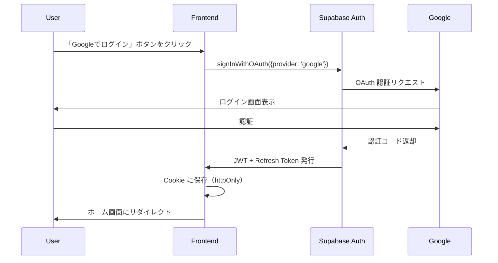
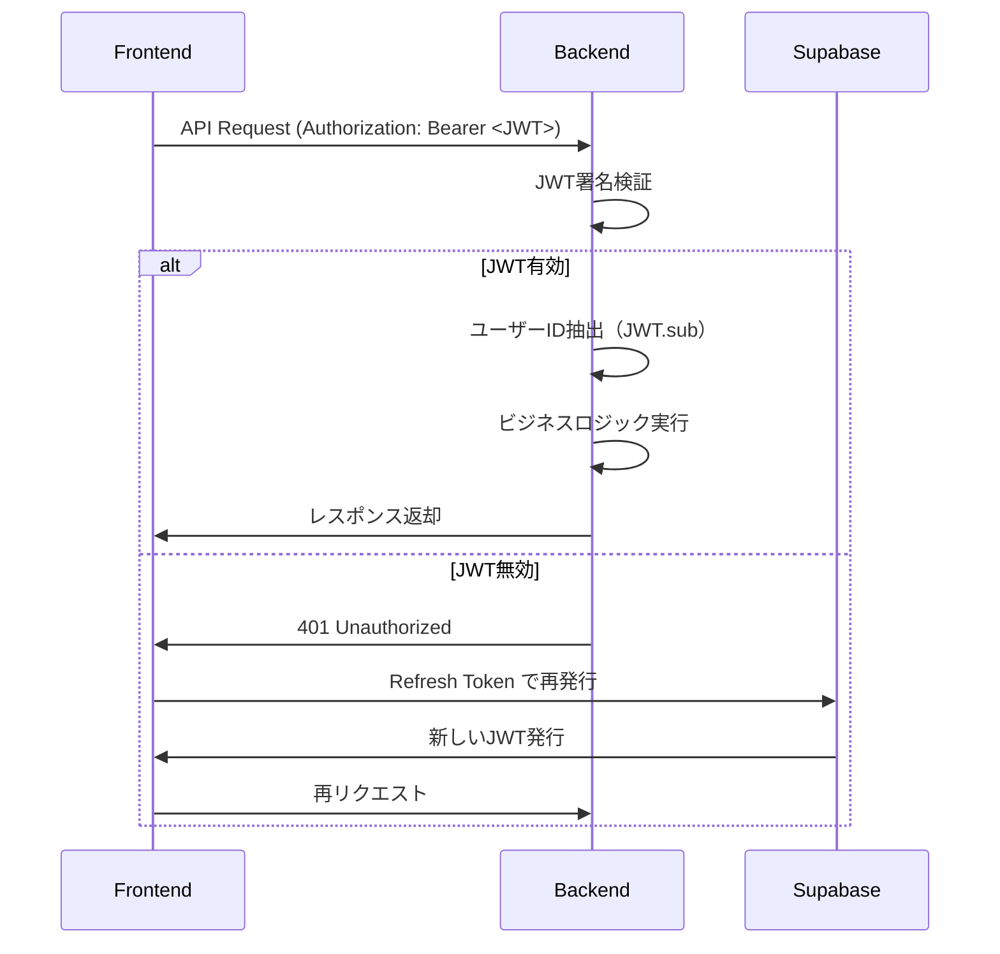

# 技術仕様・非機能要件

本ドキュメントは Muse Log の技術的な詳細仕様、データベース設計、セキュリティ要件、パフォーマンス要件を定義します。

## 📑 目次

1. [技術スタック](#1-技術スタック)
2. [データベース設計](#2-データベース設計)
3. [API設計](#3-api設計)
4. [認証・認可](#4-認証認可)
5. [セキュリティ](#5-セキュリティ)
6. [エラーハンドリング](#6-エラーハンドリング)

---

## 1. 技術スタック

### 1.1 フロントエンド

| カテゴリ               | 技術                         | バージョン          | 用途                                            |
| :--------------------- | :--------------------------- | :------------------ | :---------------------------------------------- |
| **Framework**          | Next.js                      | 16.1.6 (App Router) | React フレームワーク、SSR/SSG                   |
| **Language**           | TypeScript                   | 5.x                 | 型安全性                                        |
| **UI Library**         | React                        | 19.x                | コンポーネントベース開発                        |
| **Styling**            | Tailwind CSS                 | 4.x                 | ユーティリティファースト CSS                    |
| **UI Components**      | Shadcn UI                    | -                   | shadcn/uiのコンポーネントをベースにカスタマイズ |
| **Forms**              | React Hook Form              | 7.x                 | フォーム管理                                    |
| **Validation**         | Zod                          | 3.x                 | スキーマバリデーション                          |
| **Data Fetching**      | TanStack Query (React Query) | 5.x                 | サーバー状態管理                                |
| **Auth**               | Supabase JS Client           | 2.x                 | 認証・セッション管理                            |
| **Icons**              | Lucide React                 | -                   | アイコンライブラリ                              |
| **Notifications**      | Sonner                       | -                   | トースト通知                                    |
| **Image Optimization** | Next.js Image                | -                   | 自動画像最適化                                  |

### 1.2 バックエンド

| カテゴリ        | 技術                    | バージョン | 用途                     |
| :-------------- | :---------------------- | :--------- | :----------------------- |
| **Language**    | Go                      | 1.26.x     | サーバーサイドロジック   |
| **Framework**   | Echo                    | 4.x        | Webフレームワーク        |
| **ORM**         | GORM                    | 1.25+      | データベースORM          |
| **DB Driver**   | pgx                     | 5.x        | PostgreSQL ドライバー    |
| **Validation**  | go-playground/validator | 10.x       | リクエストバリデーション |
| **JWT**         | golang-jwt/jwt          | 5.x        | JWTトークン検証          |
| **HTTP Client** | resty                   | 2.x        | DMM API 通信             |
| **Testing**     | testify                 | 1.x        | テストライブラリ         |

### 1.3 インフラ・SaaS

| カテゴリ               | サービス                | 用途                        |
| :--------------------- | :---------------------- | :-------------------------- |
| **Hosting (Frontend)** | Vercel                  | Next.js ホスティング、CDN   |
| **Hosting (Backend)**  | さくらのVPS             | Docker コンテナホスト       |
| **Database**           | Supabase PostgreSQL     | メインデータベース          |
| **Auth**               | Supabase Auth           | 認証・ユーザー管理          |
| **Storage**            | Supabase Storage        | OGP画像保存                 |
| **Reverse Proxy**      | Nginx                   | SSL終端、リクエスト振り分け |
| **Container**          | Docker / Docker Compose | コンテナ化、環境統一        |
| **CI/CD**              | GitHub Actions          | 自動テスト・デプロイ        |
| **Registry**           | GHCR                    | Docker イメージレジストリ   |

---

## 2. データベース設計

### 2.1 全体方針

- **正規化**: 第3正規形まで正規化
- **外部キー制約**: すべての関連に外部キー制約を設定
- **インデックス**: 検索頻度の高いカラムにインデックス作成
- **論理削除**: ユーザーデータは物理削除せず `deleted_at` で論理削除（GDPR対応時に検討）
- **タイムスタンプ**: すべてのテーブルに `created_at`, `updated_at` を設定

### 2.2 スキーマ定義

#### 2.2.1 users テーブル

Supabase Auth の `auth.users` を参照する拡張テーブル。

```sql
CREATE TABLE users (
  id UUID PRIMARY KEY REFERENCES auth.users(id) ON DELETE CASCADE,
  nickname VARCHAR(50) NOT NULL,
  email VARCHAR(255) NOT NULL UNIQUE,
  created_at TIMESTAMPTZ NOT NULL DEFAULT NOW(),
  updated_at TIMESTAMPTZ NOT NULL DEFAULT NOW()
);

-- Indexes
CREATE INDEX idx_users_email ON users(email);

-- Triggers
CREATE TRIGGER update_users_updated_at
  BEFORE UPDATE ON users
  FOR EACH ROW
  EXECUTE FUNCTION update_updated_at_column();
```

**カラム説明**:

- `id`: Supabase Auth のユーザーID（UUID）
- `nickname`: 表示名（初期値はメールアドレスの@より前）
- `email`: Supabase Auth と同期（重複チェック用）

---

#### 2.2.2 actresses テーブル

女優のマスターデータ。DMM API から取得した情報を保存。

```sql
CREATE TABLE actresses (
  id BIGSERIAL PRIMARY KEY,
  dmm_actress_id VARCHAR(50) NOT NULL UNIQUE, -- DMM API の女優ID
  name VARCHAR(100) NOT NULL,
  image_url TEXT, -- DMM or Supabase Storage の画像URL
  fanza_url TEXT,
  bust SMALLINT CHECK (bust > 0 AND bust < 200),
  waist SMALLINT CHECK (waist > 0 AND waist < 200),
  hip SMALLINT CHECK (hip > 0 AND hip < 200),
  height SMALLINT CHECK (height > 0 AND height < 300),
  cup VARCHAR(5),
  created_at TIMESTAMPTZ NOT NULL DEFAULT NOW(),
  updated_at TIMESTAMPTZ NOT NULL DEFAULT NOW()
);

-- Indexes
CREATE UNIQUE INDEX idx_actresses_dmm_id ON actresses(dmm_actress_id);
CREATE INDEX idx_actresses_name ON actresses(name); -- 名前検索用
CREATE INDEX idx_actresses_cup ON actresses(cup); -- カップサイズ検索用

-- Triggers
CREATE TRIGGER update_actresses_updated_at
  BEFORE UPDATE ON actresses
  FOR EACH ROW
  EXECUTE FUNCTION update_updated_at_column();
```

**重複防止**:

- `dmm_actress_id` に UNIQUE 制約 → 同じ女優が複数回登録されるのを防止
- お気に入り追加時、バックエンドで `dmm_actress_id` の存在チェック実施

**データ同期**:

- DMM API から取得した情報は定期的に更新しない（静的データとして扱う）
- 画像URLが切れた場合は、Supabase Storage にコピーして永続化

---

#### 2.2.3 reviews テーブル

ユーザーのお気に入り登録と評価を保存。

```sql
CREATE TABLE reviews (
  id BIGSERIAL PRIMARY KEY,
  user_id UUID NOT NULL REFERENCES users(id) ON DELETE CASCADE,
  actress_id BIGINT NOT NULL REFERENCES actresses(id) ON DELETE CASCADE,
  rating SMALLINT CHECK (rating >= 1 AND rating <= 5), -- NULL許可（評価なし）
  memo TEXT CHECK (LENGTH(memo) <= 500), -- 最大500文字
  created_at TIMESTAMPTZ NOT NULL DEFAULT NOW(),
  updated_at TIMESTAMPTZ NOT NULL DEFAULT NOW(),
  UNIQUE(user_id, actress_id) -- 1ユーザー1女優1レビュー
);

-- Indexes
CREATE INDEX idx_reviews_user_id ON reviews(user_id);
CREATE INDEX idx_reviews_actress_id ON reviews(actress_id);
CREATE INDEX idx_reviews_rating ON reviews(rating); -- 評価でソート
CREATE INDEX idx_reviews_created_at ON reviews(created_at DESC); -- 登録日順ソート

-- Triggers
CREATE TRIGGER update_reviews_updated_at
  BEFORE UPDATE ON reviews
  FOR EACH ROW
  EXECUTE FUNCTION update_updated_at_column();
```

**制約**:

- `UNIQUE(user_id, actress_id)`: 1ユーザーが同じ女優を複数回お気に入り登録できないようにする
- `rating`: NULL許可（評価なしで追加した場合）

**お気に入り動画について**:

お気に入り動画のURLはDMM APIから取得するため、DBへの永続化は不要。

---

#### 2.2.4 tags テーブル

ユーザーが作成したタグのマスターテーブル。

```sql
CREATE TABLE tags (
  id BIGSERIAL PRIMARY KEY,
  user_id UUID NOT NULL REFERENCES users(id) ON DELETE CASCADE,
  name VARCHAR(50) NOT NULL,
  created_at TIMESTAMPTZ NOT NULL DEFAULT NOW(),
  updated_at TIMESTAMPTZ NOT NULL DEFAULT NOW(),
  UNIQUE(user_id, name) -- 1ユーザー内でタグ名重複不可
);

-- Indexes
CREATE INDEX idx_tags_user_id ON tags(user_id);
CREATE INDEX idx_tags_name ON tags(name); -- タグ名での検索

-- Triggers
CREATE TRIGGER update_tags_updated_at
  BEFORE UPDATE ON tags
  FOR EACH ROW
  EXECUTE FUNCTION update_updated_at_column();
```

**設計方針**:

- タグはユーザーごとに管理（グローバルタグではない）
- 同じユーザーが同じ名前のタグを複数作成できないようにする

---

#### 2.2.5 review_tags テーブル

レビューとタグの中間テーブル（多対多関係）。

```sql
CREATE TABLE review_tags (
  id BIGSERIAL PRIMARY KEY,
  review_id BIGINT NOT NULL REFERENCES reviews(id) ON DELETE CASCADE,
  tag_id BIGINT NOT NULL REFERENCES tags(id) ON DELETE CASCADE,
  created_at TIMESTAMPTZ NOT NULL DEFAULT NOW(),
  updated_at TIMESTAMPTZ NOT NULL DEFAULT NOW(),
  UNIQUE(review_id, tag_id) -- 1レビューに同じタグを複数回付与できない
);

-- Indexes
CREATE INDEX idx_review_tags_review_id ON review_tags(review_id);
CREATE INDEX idx_review_tags_tag_id ON review_tags(tag_id);

-- Triggers
CREATE TRIGGER update_review_tags_updated_at
  BEFORE UPDATE ON review_tags
  FOR EACH ROW
  EXECUTE FUNCTION update_updated_at_column();
```

---

### 2.3 Row Level Security (RLS) ポリシー

Supabase DB では RLS を有効化し、各ユーザーが自分のデータのみアクセスできるようにします。

#### users テーブル

```sql
ALTER TABLE users ENABLE ROW LEVEL SECURITY;

-- ユーザーは自分のプロフィールのみ閲覧・更新可能
CREATE POLICY "Users can view own profile" ON users
  FOR SELECT USING (auth.uid() = id);

CREATE POLICY "Users can update own profile" ON users
  FOR UPDATE USING (auth.uid() = id);
```

#### reviews テーブル

```sql
ALTER TABLE reviews ENABLE ROW LEVEL SECURITY;

-- ユーザーは自分のレビューのみ CRUD 可能
CREATE POLICY "Users can manage own reviews" ON reviews
  FOR ALL USING (auth.uid() = user_id);
```

#### tags テーブル

```sql
ALTER TABLE tags ENABLE ROW LEVEL SECURITY;

-- ユーザーは自分のタグのみ CRUD 可能
CREATE POLICY "Users can manage own tags" ON tags
  FOR ALL USING (auth.uid() = user_id);
```

#### actresses テーブル

```sql
ALTER TABLE actresses ENABLE ROW LEVEL SECURITY;

-- 全ユーザーが閲覧可能（マスターデータ）
CREATE POLICY "All users can view actresses" ON actresses
  FOR SELECT USING (true);

-- バックエンドのみ INSERT/UPDATE 可能（Service Role Key 使用）
```

---

### 2.4 データ整合性チェック

#### バックエンドでの制約

- **重複チェック**: `actresses` の `dmm_actress_id` が既存か確認してから INSERT
- **外部キー検証**: レビュー作成時、`actress_id` が存在するか確認
- **タグ制限**: 1レビューあたり最大5タグ（アプリケーションレベルで制限）

---

## 3. API設計

### 3.1 API 基本仕様

#### ベースURL

- **本番**: `https://api.muselog.jp`
- **開発**: `http://localhost:8080`

#### 認証方式

- **Bearer Token**: `Authorization: Bearer <JWT>`
- Supabase Auth が発行した JWT を使用

#### レスポンス形式

- **成功**: JSON形式、適切なステータスコード（200, 201, 204）
- **エラー**: JSON形式、エラーメッセージを含む

```json
{
  "error": {
    "code": "INVALID_REQUEST",
    "message": "女優IDが不正です",
    "details": ["actress_id must be a positive integer"]
  }
}
```

---

### 3.2 エンドポイント一覧

#### 認証関連（Supabase Auth 使用）

フロントエンドから Supabase JS Client を直接使用するため、バックエンドにエンドポイント不要。

---

#### レビュー（お気に入り）管理

| メソッド | エンドポイント     | 説明                                                         | 認証 |
| :------- | :----------------- | :----------------------------------------------------------- | :--- |
| GET      | `/api/reviews`     | レビュー一覧取得（ページネーション・ソート・フィルター対応） | 必須 |
| GET      | `/api/reviews/:id` | レビュー詳細取得                                             | 必須 |
| POST     | `/api/reviews`     | レビュー新規作成（お気に入り追加）                           | 必須 |
| PATCH    | `/api/reviews/:id` | レビュー更新                                                 | 必須 |
| DELETE   | `/api/reviews/:id` | レビュー削除（お気に入り解除）                               | 必須 |

---

##### GET `/api/reviews`

**クエリパラメータ**:

```
?page=1&per_page=20&sort=created_at&order=desc&tag=巨乳&rating_min=4&q=山田
```

| パラメータ   | 型      | 説明                                         | デフォルト   |
| :----------- | :------ | :------------------------------------------- | :----------- |
| `page`       | integer | ページ番号（1〜）                            | 1            |
| `per_page`   | integer | 1ページあたりの件数（1〜100）                | 20           |
| `sort`       | string  | ソートキー（`created_at`, `rating`, `name`） | `created_at` |
| `order`      | string  | ソート順（`asc`, `desc`）                    | `desc`       |
| `tag`        | string  | タグ名でフィルター（完全一致）               | -            |
| `rating_min` | integer | 最低評価（1〜5）                             | -            |
| `q`          | string  | 女優名で部分一致検索                         | -            |

**レスポンス例**:

```json
{
  "reviews": [
    {
      "id": 123,
      "actress": {
        "id": 456,
        "name": "山田花子",
        "image_url": "https://...",
        "fanza_url": "https://...",
        "bust": 88,
        "waist": 58,
        "hip": 86,
        "height": 160,
        "cup": "E"
      },
      "rating": 5,
      "memo": "メモ",
      "tags": ["巨乳", "美人"],
      "created_at": "2024-03-01T10:00:00Z",
      "updated_at": "2024-03-10T15:30:00Z"
    }
  ],
  "pagination": {
    "total": 100,
    "page": 1,
    "per_page": 20,
    "total_pages": 5
  }
}
```

**SQL例**:

```sql
SELECT r.*, a.*, array_agg(t.*) as tags
FROM reviews r
JOIN actresses a ON r.actress_id = a.id
LEFT JOIN review_tags rt ON r.id = rt.review_id
LEFT JOIN tags t ON rt.tag_id = t.id
WHERE r.user_id = $1
  AND (a.name ILIKE $2 OR $2 IS NULL) -- 名前検索
  AND (r.rating >= $3 OR $3 IS NULL) -- 評価フィルター
  AND (t.name = $4 OR $4 IS NULL) -- タグフィルター
GROUP BY r.id, a.id
ORDER BY r.created_at DESC
LIMIT $5 OFFSET $6;
```

---

##### POST `/api/reviews`

**リクエストボディ**:

```json
{
  "actress_id": 456,
  "rating": 5,
  "memo": "メモ",
  "tags": ["巨乳", "美人"]
}
```

**バリデーション**:

- `actress_id`: 必須、存在確認
- `rating`: 1〜5、NULL許可（評価なし）
- `memo`: 最大500文字
- `tags`: 最大5個（タグ名の文字列配列）

**処理フロー**:

1. JWTからユーザーID取得
2. `actress_id` が `actresses` テーブルに存在するか確認
3. 重複チェック（`UNIQUE(user_id, actress_id)` 違反）
4. `reviews` テーブルに INSERT
5. タグ名で `tags` テーブルの存在確認、未登録なら INSERT
6. `review_tags` テーブルに中間レコード INSERT
7. レスポンス返却

---

##### PATCH `/api/reviews/:id`

**リクエストボディ**:

```json
{
  "rating": 4,
  "memo": "更新後のメモ",
  "tags": ["美人", "スレンダー"]
}
```

**処理フロー**:

1. レビューの所有者確認（`user_id` = JWT の `sub`）
2. `reviews` テーブルを UPDATE
3. 既存の `review_tags` を DELETE
4. タグ名で `tags` テーブルの存在確認、未登録なら INSERT
5. 新しい `review_tags` を INSERT

---

#### 女優検索

| メソッド | エンドポイント       | 説明               | 認証 |
| :------- | :------------------- | :----------------- | :--- |
| GET      | `/api/dmm/actresses` | DMM API で女優検索 | 必須 |

**クエリパラメータ**:

```
?keyword=山田&page=1&per_page=20
```

**処理フロー**:

1. バックエンド内のキャッシュチェック（TTL: 24時間）
2. キャッシュヒット → 即座にレスポンス返却
3. キャッシュミス → DMM API 呼び出し
4. レスポンスをキャッシュ
5. `actresses` テーブルに未登録の女優情報を INSERT
6. フロントエンドにレスポンス返却

**レスポンス例**:

```json
{
  "actresses": [
    {
      "id": 456, // actresses.id (既存の場合)
      "id": "12345",
      "name": "山田花子",
      "ruby": "やまだ はなこ",
      "image_url": "https://...",
      "fanza_url": "https://...",
      "bust": 88,
      "waist": 58,
      "hips": 86,
      "height": 160,
      "cup": "E"
    }
  ],
  "pagination": {
    "total": 50,
    "page": 1,
    "per_page": 20
  }
}
```

---

#### タグ管理

| メソッド | エンドポイント  | 説明                                      | 認証 |
| :------- | :-------------- | :---------------------------------------- | :--- |
| GET      | `/api/tags`     | ユーザーのタグ一覧取得                    | 必須 |
| POST     | `/api/tags`     | タグ新規作成                              | 必須 |
| DELETE   | `/api/tags/:id` | タグ削除（関連する `review_tags` も削除） | 必須 |

---

### 3.3 エラーコード一覧

| HTTP Status | エラーコード            | 説明                                         |
| :---------- | :---------------------- | :------------------------------------------- |
| 400         | `INVALID_REQUEST`       | リクエストパラメータが不正                   |
| 401         | `UNAUTHORIZED`          | 認証トークンが無効または期限切れ             |
| 403         | `FORBIDDEN`             | リソースへのアクセス権限なし                 |
| 404         | `NOT_FOUND`             | リソースが見つからない                       |
| 409         | `CONFLICT`              | リソースの重複（例: 既にお気に入り登録済み） |
| 429         | `RATE_LIMIT_EXCEEDED`   | レート制限超過                               |
| 500         | `INTERNAL_SERVER_ERROR` | サーバー内部エラー                           |
| 503         | `SERVICE_UNAVAILABLE`   | 外部API（DMM）が利用不可                     |

---

## 4. 認証・認可

### 4.1 認証フロー

#### OAuth (Google) ログイン



---

### 4.2 JWT検証フロー（バックエンド）



**Go実装例**:

```go
func VerifyJWT(token string) (*jwt.Token, error) {
    return jwt.Parse(token, func(token *jwt.Token) (interface{}, error) {
        // Supabase の公開鍵で検証
        return supabasePublicKey, nil
    })
}
```

---

### 4.3 セッション管理

#### トークン保存方法

- **アクセストークン**: `httpOnly` Cookie（XSS対策）
- **リフレッシュトークン**: `httpOnly` Cookie（自動更新）

#### トークン有効期限

- **アクセストークン**: 1時間
- **リフレッシュトークン**: 7日間

#### 自動更新

Supabase JS Client が自動で Refresh Token を使用してアクセストークンを更新します。

---

### 4.4 アクセス制御

#### フロントエンド

- 未ログイン時は検索画面のみアクセス可能
- ログイン後に一覧・詳細・設定画面にアクセス可能
- Next.js Middleware でルート保護

```typescript
// middleware.ts
export function middleware(request: NextRequest) {
  const token = request.cookies.get("sb-access-token");
  if (!token && request.nextUrl.pathname !== "/login") {
    return NextResponse.redirect(new URL("/login", request.url));
  }
}
```

#### バックエンド

- すべてのAPIエンドポイントで JWT 検証
- Echo Middleware で実装

```go
func JWTMiddleware() echo.MiddlewareFunc {
    return func(next echo.HandlerFunc) echo.HandlerFunc {
        return func(c echo.Context) error {
            token := extractToken(c)
            claims, err := VerifyJWT(token)
            if err != nil {
                return echo.NewHTTPError(http.StatusUnauthorized)
            }
            c.Set("user_id", claims.Sub)
            return next(c)
        }
    }
}
```

---

## 5. セキュリティ

### 5.1 データ保護

#### HTTPS通信

- すべての通信を HTTPS で暗号化
- Let's Encrypt で SSL証明書を自動更新

#### 環境変数管理

- **開発環境**: `.env.local` ファイル（Git管理外）
- **本番環境**: GitHub Secrets → 環境変数として注入

**主要な環境変数**:

```bash
# Supabase
NEXT_PUBLIC_SUPABASE_URL=https://xxx.supabase.co
NEXT_PUBLIC_SUPABASE_ANON_KEY=eyJ...
SUPABASE_SERVICE_ROLE_KEY=eyJ... # バックエンドのみ

# DMM API
DMM_API_ID=xxx
DMM_AFFILIATE_ID=xxx

# Sentry
SENTRY_DSN=https://xxx@sentry.io/xxx
```

---

### 5.2 脆弱性対策

#### XSS (Cross-Site Scripting)

- React は自動でエスケープ処理を行う
- `dangerouslySetInnerHTML` は使用しない
- CSP (Content Security Policy) ヘッダーを設定

```typescript
// next.config.js
const securityHeaders = [
  {
    key: "Content-Security-Policy",
    value:
      "default-src 'self'; script-src 'self' require-trusted-types-for 'script';",
  },
];
```

#### CSRF (Cross-Site Request Forgery)

- Supabase Auth が自動で CSRF トークンを発行・検証
- バックエンドでは SameSite Cookie を使用

#### SQL Injection

- GORM のプリペアドステートメントを使用
- 生SQLは極力使用しない

#### レート制限

- **フロントエンド**: 検索入力に 400ms デバウンス
- **バックエンド**: インメモリまたはDB管理で実装（1ユーザーあたり 10リクエスト/分）

---

### 5.3 データアクセス制御

#### Supabase RLS

- Row Level Security でユーザーごとにデータを完全分離
- バックエンドは Service Role Key でアクセス（RLS バイパス）

#### バックエンドでの権限チェック

```go
// レビュー更新前に所有者確認
review, _ := getReviewByID(reviewID)
if review.UserID != currentUserID {
    return echo.NewHTTPError(http.StatusForbidden)
}
```

---

## 6. エラーハンドリング

### 6.1 フロントエンドエラーハンドリング

#### エラーバウンダリ

```typescript
// app/error.tsx
export default function Error({ error, reset }: {
  error: Error;
  reset: () => void;
}) {
  return (
    <div>
      <h2>エラーが発生しました</h2>
      <button onClick={reset}>再試行</button>
    </div>
  );
}
```

#### トースト通知

```typescript
import { toast } from "sonner";

try {
  await createReview(data);
  toast.success("お気に入りに追加しました");
} catch (error) {
  toast.error("追加に失敗しました");
}
```

---

### 6.2 バックエンドエラーハンドリング

#### グローバルエラーハンドラ

```go
func ErrorHandler(err error, c echo.Context) {
    code := http.StatusInternalServerError
    message := "Internal Server Error"

    if he, ok := err.(*echo.HTTPError); ok {
        code = he.Code
        message = he.Message.(string)
    }

    // Sentry にエラー送信（本番環境のみ）
    if config.Env == "production" {
        sentry.CaptureException(err)
    }

    c.JSON(code, map[string]interface{}{
        "error": map[string]string{
            "message": message,
        },
    })
}
```

---

### 6.3 外部API エラー対応

#### DMM API エラー

- **タイムアウト**: 5秒でタイムアウト、エラーレスポンス返却
- **レート制限**: 429エラー → バックエンドでリトライ制御
- **データ不正**: 女優情報が欠損している場合はスキップ

```go
client := resty.New().SetTimeout(5 * time.Second)
resp, err := client.R().Get(dmmAPIURL)
if err != nil {
    return echo.NewHTTPError(http.StatusServiceUnavailable, "DMM API is unavailable")
}
```

---

_Last Updated: 2026-04-01_
